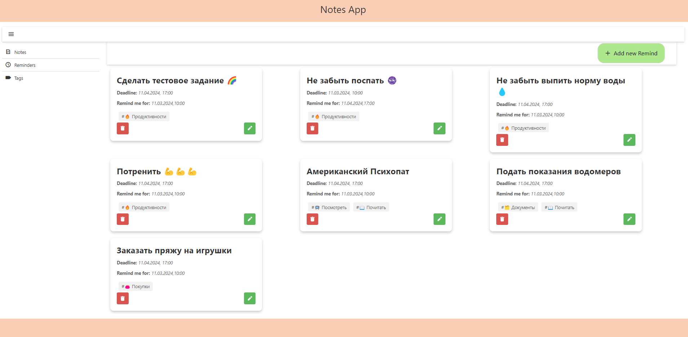

# NotesApp

**NotesApp** - это веб-приложение для заметок,напоминаний и тегов разработанное с использованием Angular. Приложение позволяет пользователям создавать, просматривать и управлять персональными заметками, тегами и напоминаниями.

## Навигация

- [Использование](#installation)
- [Функции](#features)
- [Зависимости](#configuration)
- [Краткое описание компонент](#components)
- [Краткое описание сервисов](#services)
- [Неисправности](#troubleshooting)

## <a id="installation">Использование</a>
- Считается, что у вас уже установлен Angular CLI.  Если у вас его нет, установите через командную строку: `npm install -g @angular/cli`
- Скопировать репозиторий через командную строку:`git clone git@github.com:w1llow1sp/notes-app.git`
- Открыть проект через любую IDE 
- Установить все зависимости через команду:`npm install`
- Запустить проект через команду:`ng serve`
-  Вас перенаправит на `http://localhost:4200/`.   Приложение автоматически перезагрузится, если вы измените какой-либо исходный файл.

## <a id="features">Функции</a>
- создание, редактирование, удаление заметок;
- установка тегов;
- создание тегов;
- прикрепление заметки к определённой дате и определённому времени;
- список заметок и напоминаний;
- напоминание о заметке к определённой дате через модальное окно
## <a id="configuration">Зависимости</a>
- **Angular:** Ядро приложения основано на фреймворке Angular, который используется для создания веб-приложений. Версия Angular в проекте - 17.3.0. Angular предоставляет мощные инструменты для разработки SPA (Single Page Applications), включая модульную систему, систему маршрутизации, и поддержку TypeScript.
- **DevExtreme и DevExtreme Angular:** Проект использует библиотеку DevExtreme для создания пользовательского интерфейса. DevExtreme предлагает широкий спектр компонентов UI, включая виджеты для работы с данными, диалоговые окна, и другие элементы интерфейса. Версия DevExtreme в проекте - 23.2.5. DevExtreme Angular - это набор компонентов Angular, разработанных для работы с DevExtreme, обеспечивая интеграцию и поддержку Angular-приложений.
- **angular-in-memory-web-api:** Этот пакет используется для имитации работы с сервером в Angular-приложениях, позволяя разработчикам тестировать и демонстрировать функциональность приложения без необходимости подключения к реальному серверу.
- **RxJS:** Библиотека RxJS используется для работы с асинхронными операциями и потоками данных. RxJS предоставляет мощные инструменты для создания реактивных приложений, включая операторы для трансформации, фильтрации и комбинирования потоков данных.
- **TypeScript:** TypeScript используется в проекте для статической типизации, что улучшает читаемость кода и обеспечивает раннее обнаружение ошибок.
## <a id="components">Краткое описание компонент</a>

+ **BaseDataComponent :**  представляет собой абстрактный базовый класс для работы с данными, реализующий интерфейс IDataService<T>. Она предназначена для управления данными типа T, предоставляя функционал для загрузки, добавления и удаления элементов данных.   Компонента использует сервис данных (dataService), сервис маршрутизации (router) и сервис загрузки (loadingService) для выполнения своих задач.  
+ **FooterComponent :**  представляет собой простую компоненту, которая использует модуль DxBoxModule из библиотеки DevExtreme для Angular.   Эта компонента предназначена для отображения нижней части (футера) веб-страницы.  
+ **HeaderComponent :**  использует модуль DxBoxModule из библиотеки DevExtreme для Angular и представляет собой компонент заголовка (header) приложения.   Эта компонента предназначена для отображения верхней части (заголовка) веб-страницы, используя DevExtreme компоненты для создания адаптивного и стилизованного заголовка.  
+ **Компонент NotesComponent** расширяет абстрактный класс BaseDataComponent<Notes>использует следующие сервисы и компоненты 
+ + **RequestService** для взаимодействия с сервером и получения данных о заметках. 
+ + **Router** для навигации между различными частями приложения. 
+ + **LoadingService** для управления состоянием загрузки данных. 
+ + **CardComponent, NotesDetailsComponent, NoteAddComponent, DevExtremeModule, SectionWrapperComponent, и LoadingComponent для отображения и управления интерфейсом пользователя.** 
      
+ **RemindersComponent :**  расширяет абстрактный класс BaseDataComponent<Remind>, предназначенный для работы с данными типа Remind. Эта компонента представляет собой основной интерфейс для управления напоминаниями (reminders) в приложении, включая добавление, просмотр деталей и удаление напоминаний.
+ + **RequestRemindService**  для взаимодействия с сервером и получения данных о напоминаниях.
+ + **TagsServiceService**  для работы с тегами, которые могут быть связаны с напоминаниями.
+ + **Router**  для навигации между различными частями приложения.
+ + **LoadingService**  для управления состоянием загрузки данных.
+ + **SectionWrapperComponent, RemindCardComponent, и LoadingComponent для отображения и управления интерфейсом пользователя.** 
      
+ + **SidebarComponent :**   представляет собой боковую панель (sidebar) приложения, использующую компоненты DevExtreme для Angular, такие как DxDrawerModule, DxListModule, и DxToolbarModule, для создания адаптивного и интерактивного интерфейса. Эта компонента предназначена для отображения навигационного меню и управления его состоянием, включая открытие и закрытие боковой панели, а также навигацию по различным разделам приложения.
+ + **SidebarServiceService**   для получения содержимого боковой панели и списка навигации.
+ + **Router**   для навигации между различными частями приложения.
+ + **DxDrawerModule, DxListModule, и DxToolbarModule**  из библиотеки DevExtreme для Angular для создания адаптивного и стилизованного интерфейса.
+ **TagsComponent**  расширяет абстрактный класс BaseDataComponent<Tag>, предназначенный для работы с данными типа Tag. Эта компонента представляет собой основной интерфейс для управления тегами (tags) в приложении, включая добавление, просмотр деталей и удаление тегов.
+ + **TagsServiceService**  для взаимодействия с сервером и получения данных о тегах.
+ + **Router**  для навигации между различными частями приложения.
+ + **LoadingService**  для управления состоянием загрузки данных.
+ + **SectionWrapperComponent, TagsCardComponent, и LoadingComponent для отображения и управления интерфейсом пользователя.** 
      
## <a id="services">Краткое описание сервисов</a>
+ **Сервис DataService<T> :**  представляет собой обобщенный сервис для выполнения операций CRUD (Create, Read, Update, Delete) с данными типа T через HTTP-запросы к серверу. Этот сервис использует HttpClient для отправки запросов и получения данных, а также Observable для асинхронной обработки ответов от сервера.  
+ **Сервис InMemoryDataService :**  реализует интерфейс InMemoryDbService из библиотеки angular-in-memory-web-api, предоставляя встроенную базу данных в памяти для имитации работы с сервером в Angular-приложениях. Этот сервис используется для создания и управления данными типа Note, Remind, и Tag в памяти, что позволяет разработчикам тестировать и демонстрировать функциональность приложения без необходимости подключения к реальному серверу.
+ **LoadingService :**  использует BehaviorSubject из библиотеки RxJS для управления состоянием загрузки данных в приложении. Этот сервис предоставляет механизм для отображения индикатора загрузки в пользовательском интерфейсе, когда приложение выполняет асинхронные операции, такие как запросы к серверу или обработка данных.
+ **RequestService :**  расширяет базовый сервис DataService<Note>, предназначенный для работы с данными типа Note. Этот сервис использует HttpClient для выполнения HTTP-запросов к серверу, позволяя выполнять операции CRUD (Create, Read, Update, Delete) с заметками (notes) в приложении.
+ **RequestRemindService :**  расширяет базовый сервис DataService<Remind>, предназначенный для работы с данными типа Remind. Этот сервис использует HttpClient для выполнения HTTP-запросов к серверу, позволяя выполнять операции CRUD (Create, Read, Update, Delete) с напоминаниями (reminders) в приложении.
+ **SidebarServiceService :**  предоставляет функциональность для управления навигационным меню боковой панели (sidebar) в приложении. Этот сервис используется для предоставления списка навигации и содержимого боковой панели, что позволяет компонентам приложения легко интегрировать и настраивать боковую панель.
+ **TagsServiceService :**   расширяет базовый сервис DataService<Tag>, предназначенный для работы с данными типа Tag. Этот сервис использует HttpClient для выполнения HTTP-запросов к серверу, позволяя выполнять операции CRUD (Create, Read, Update, Delete) с тегами (tags) в приложении. Кроме того, сервис реализует кэширование тегов для улучшения производительности и уменьшения количества запросов к серверу.
## <a id="troubleshooting">Неисправности</a>
- Есть баг, связанный с обновление имени тега: он меняется в в tags. но не изменяется в reminds
- Есть баг, связанный с удалением тега: он удаляется из в tags, но не удаляется в reminds (если тег был использован в напоминаниях)
- Уведомление о напоминании работает только в /reminds
